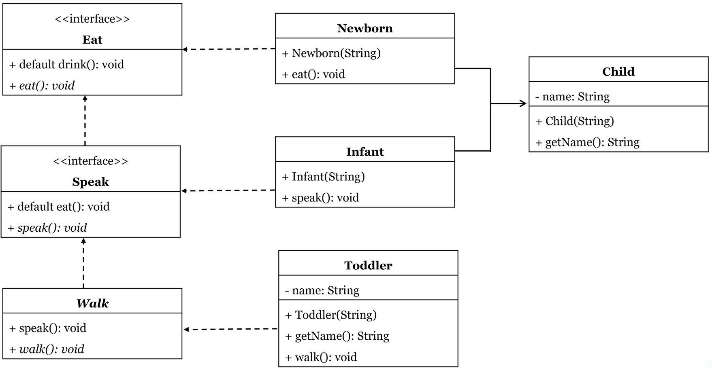

# SOURCE: 2021S2 FINAL

Consider the UML:

Create the following:

**2 interfaces:**

Eat

- It contains 1 default method called drink() which simply prints “I drink milk”
- It contains 1 abstract method called eat()

Speak

- It is an extension of Eat interface
- It contains 1 default method called eat() which simply prints “I eat solid food now”
- It contains 1 abstract method called speak()

**Abstract class which implements Speak:**

Walk

- It defines the speak() method to print “I can say my name now”
- It contains 1 abstract method called walk()

**4 classes:**
Child class

- It has 1 private attribute called name. 
- It contains a constructor to initialize the name and a getter method to return the name of the child.

Newborn class

- It is a subclass of Child and implements Eat interface
- It defines the eat() method to print “I can’t eat solid food yet”

Infant class

- It is a subclass of Child and implements Speak interface
- It defines the speak() method to print “I can say bu bu bu”

Toddler class

- It is a subclass of Walk
- It has 1 private attribute called name. 
- It contains a constructor to initialize the name and a getter method to return the name of the child.
- It defines the walk() method to print “I can now walk”