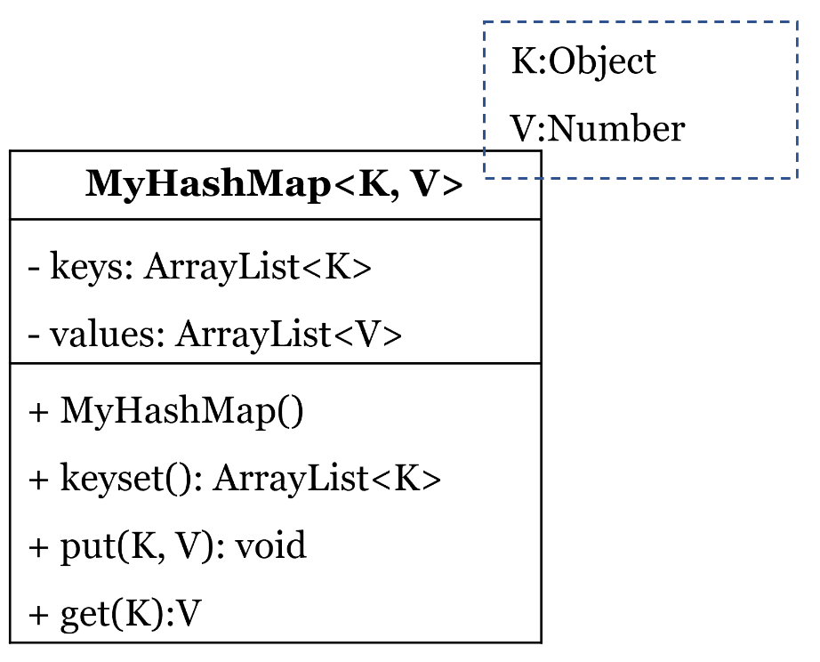

# SOURCE: 2021S2 FINAL

Create a generic HashMap class called MyHashMap.

MyHashMap<K, V> has 2 type parameters
- K for keys of the map. Note that K extends from Object
- V for the value of keys. Note that V extends from Number

MyHashMap<K, V> has following 2 attributes and a constructor to initialize these attributes:
- ArrayList<K> to store the keys
- ArrayList<V> to store the values

MyHashMap<K, V> has 3 methods:
- **keyset()** - 
It returns the arraylist of keys
- **put(K key, V value)** - 
It adds the key and its corresponding values in the arraylist. However, if the key already exists in the list, then the old value of this key will be replaced by the new value
- **get(K key)** - 
It returns the corresponding value of a key. If the key does not exist, return null.